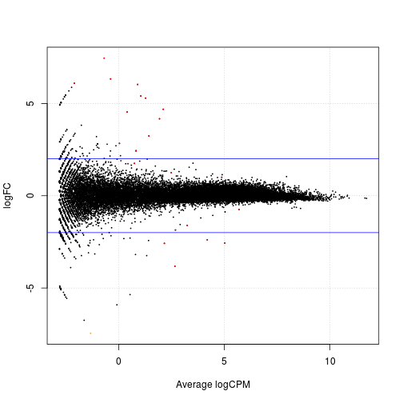
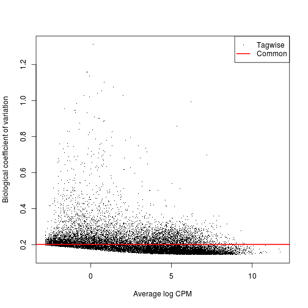
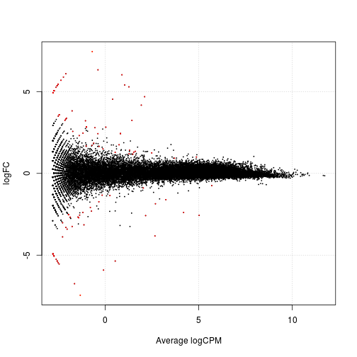
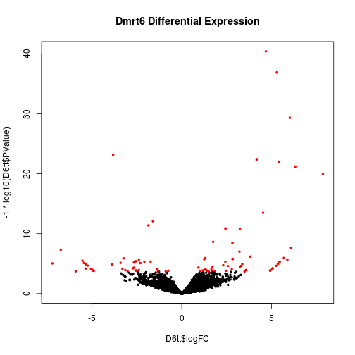
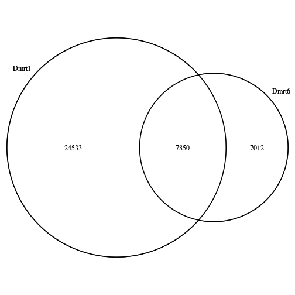
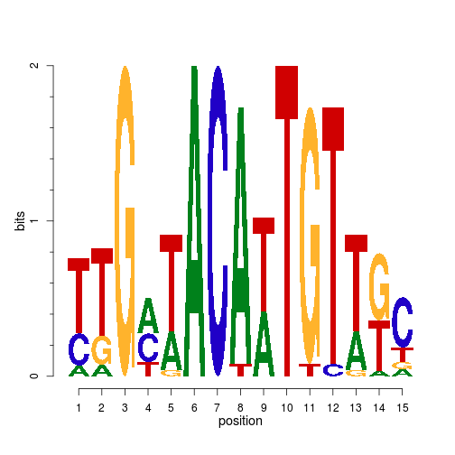
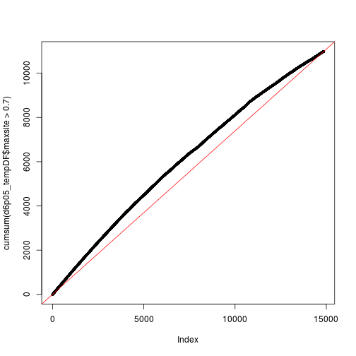
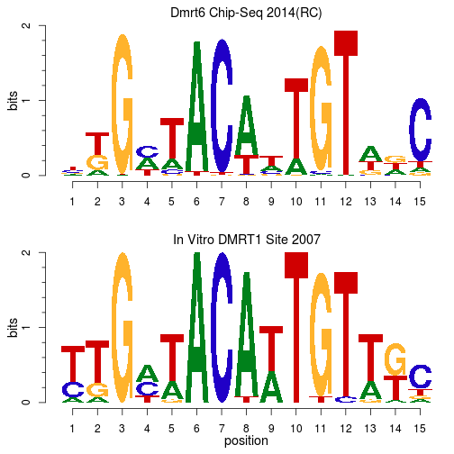
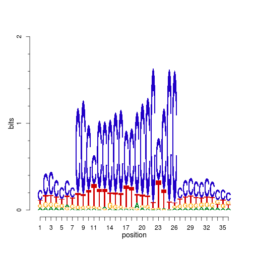
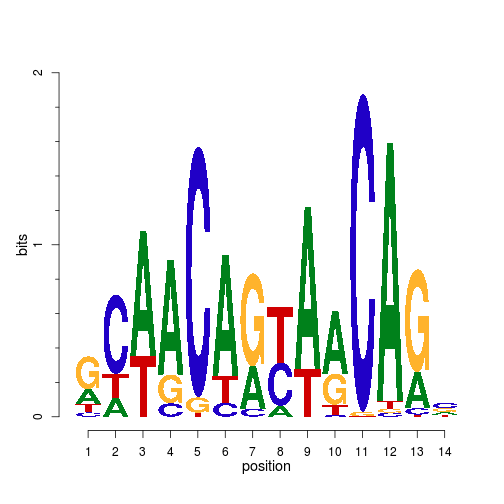

DMRT6 Integrative Analysis
========================================================


Process raw data using STAR, FASTQC, PICARD, SAMTOOLS and  IGVTOOLS  (Minnesota Supercomputing Institute)

```r
dd=/home/zarkowe0/data_release/umgc/hiseq/131125_SN261_0527_AC3540ACXX/Project_Zarkower_Project_013
wd=/home/bardwell/gearhart/dmrt6/
org=mm9

for i in 1663_1_DM6_WT_ATCACG 1663_3_DM6_WT_TTAGGC \
1663_5_DM6_Null_ACAGTG 1663_2_DM6_Null_CGATGT 1663_4_DM6_WT_TGACCA 1665_2_DM6_Null_GCCAAT

#i="${file%.*}"

do

sf1="${i}_L005_R1_001.fastq"
sf2="${i}_L005_R2_001.fastq"

cat << EOF > $i.star.pbs
#PBS -l mem=32000mb,nodes=1:ppn=4,walltime=10:00:00 
#PBS -m a
#PBS -M gearh006@umn.edu 
#PBS -q lab 
mkdir $wd/$i
cd $wd/$i
/home/bardwell/shared/STAR_2.3.0e/STAR --genomeDir /home/bardwell/shared/STAR_GENOME/$org/ \
--runThreadN 8 --readFilesIn $dd/$sf1 $dd/$sf2

qsub $wd/$i.igv.pbs

EOF

cat << EOF > $i.igv.pbs
#PBS -l mem=8000mb,nodes=1:ppn=1,walltime=08:00:00 
#PBS -m a
#PBS -M gearh006@umn.edu 
#PBS -q lab 
module load samtools

cd $wd

/home/bardwell/shared/FastQC/fastqc -o fastqc $dd/$sf1 
/home/bardwell/shared/FastQC/fastqc -o fastqc $dd/$sf2 

cd $wd/$i
#convert sam to bam
samtools view -bS -o $i.raw.bam Aligned.out.sam 

#sort the bam file
samtools sort $i.raw.bam $i.sort

#remove duplicates
java -Xmx2g -jar /home/bardwell/shared/picard-tools-1.94/MarkDuplicates.jar INPUT=$i.sort.bam OUTPUT=$i.bam REMOVE_DUPLICATES=true ASSUME_SORTED=true METRICS_FILE=$i.metrics MAX_FILE_HANDLES_FOR_READ_ENDS_MAP=1000 VALIDATION_STRINGENCY=LENIENT 

#create the index file
samtools index $i.bam

#igvtools to make a TDF File
java -Xmx2g  -jar /home/bardwell/shared/IGVTools_2/igvtools.jar count -z 5 -w 25 -e 100 $i.bam $i.tdf \
/home/bardwell/shared/IGVTools_2/genomes/$org.genome

rm $i.sort.bam
rm $i.raw.bam

mv $i.bam $wd/
mv $i.bam.bai $wd/
mv $i.tdf $wd/
EOF

qsub $i.star.pbs

done
```


Analyse Reads for differential expression with EdgeR  (RNA-SEQ mm9 version)

```r
library(Rsamtools)
```

```
## Loading required package: IRanges
## Loading required package: BiocGenerics
## Loading required package: parallel
## 
## Attaching package: 'BiocGenerics'
## 
## The following objects are masked from 'package:parallel':
## 
##     clusterApply, clusterApplyLB, clusterCall,
##     clusterEvalQ, clusterExport, clusterMap,
##     parApply, parCapply, parLapply, parLapplyLB,
##     parRapply, parSapply, parSapplyLB
## 
## The following object is masked from 'package:stats':
## 
##     xtabs
## 
## The following objects are masked from 'package:base':
## 
##     Filter, Find, Map, Position, Reduce,
##     anyDuplicated, append, as.data.frame, as.vector,
##     cbind, colnames, do.call, duplicated, eval,
##     evalq, get, intersect, is.unsorted, lapply,
##     mapply, match, mget, order, paste, pmax,
##     pmax.int, pmin, pmin.int, rank, rbind, rep.int,
##     rownames, sapply, setdiff, sort, table, tapply,
##     union, unique, unlist
## 
## Loading required package: GenomicRanges
## Loading required package: GenomeInfoDb
## Loading required package: XVector
## Loading required package: Biostrings
```

```r
library(GenomicFeatures)
```

```
## Loading required package: AnnotationDbi
## Loading required package: Biobase
## Welcome to Bioconductor
## 
##     Vignettes contain introductory material; view
##     with 'browseVignettes()'. To cite Bioconductor,
##     see 'citation("Biobase")', and for packages
##     'citation("pkgname")'.
```

```r
library(GenomicRanges)
library(GenomicAlignments)
```

```
## Loading required package: BSgenome
## 
## Attaching package: 'BSgenome'
## 
## The following object is masked from 'package:AnnotationDbi':
## 
##     species
## 
## 
## Attaching package: 'GenomicAlignments'
## 
## The following object is masked _by_ '.GlobalEnv':
## 
##     last
```

```r
library(edgeR)
```

```
## Loading required package: limma
## 
## Attaching package: 'limma'
## 
## The following object is masked from 'package:BiocGenerics':
## 
##     plotMA
```

```r
library(qvalue)

# For transcriptDB and annotations
library(biomaRt)

# For Pubmed Lookups
library(XML)

# For microarray
library(GEOquery)
```

```
## Setting options('download.file.method.GEOquery'='curl')
```

```r
library(Biobase)

# For Chip Analysis
library(rtracklayer)
library(ChIPpeakAnno)
```

```
## Loading required package: grid
## Loading required package: VennDiagram
## Loading required package: DBI
```

```r
data(TSS.mouse.NCBIM37)
library(org.Mm.eg.db)
```

```
## 
```

```r
library(GOstats)
```

```
## Loading required package: Category
## Loading required package: Matrix
## 
## Attaching package: 'Matrix'
## 
## The following object is masked from 'package:IRanges':
## 
##     expand
## 
## Loading required package: GO.db
## Loading required package: graph
## 
## Attaching package: 'graph'
## 
## The following object is masked from 'package:XML':
## 
##     addNode
## 
## The following object is masked from 'package:Biostrings':
## 
##     complement
## 
## 
## Attaching package: 'GOstats'
## 
## The following object is masked from 'package:AnnotationDbi':
## 
##     makeGOGraph
```

```r
library("GO.db")

# For Motif Analysis
library(BSgenome.Mmusculus.UCSC.mm9)
library(rGADEM)
```

```
## Loading required package: seqLogo
```

```r
library(motifStack)
```

```
## Loading required package: grImport
## Loading required package: MotIV
## 
## Attaching package: 'MotIV'
## 
## The following object is masked from 'package:rGADEM':
## 
##     readPWMfile
## 
## The following object is masked from 'package:seqLogo':
## 
##     makePWM
## 
## The following object is masked from 'package:stats':
## 
##     filter
## 
## Loading required package: ade4
## 
## Attaching package: 'ade4'
## 
## The following object is masked from 'package:rtracklayer':
## 
##     score
## 
## The following object is masked from 'package:BSgenome':
## 
##     score
## 
## The following object is masked from 'package:Biostrings':
## 
##     score
## 
## The following object is masked from 'package:GenomicRanges':
## 
##     score
## 
## The following object is masked from 'package:IRanges':
## 
##     score
```


This section uses a package called biomaRt to download data from Ensembl.  We will get a list of all the Ensembl genes in the genome
and some annotation information for these genes.  Since our data is mapped to mm9 we will use the May 2012 archive of Ensembl (their current release 
is based on mm10).   Ensembl chromosomes are numbered 1-19,X,Y whereas our bam files are references as chr1-chr19,chrX,chrY so we have to do a quick 
swtich of the chromosome names to use Ensembl genes on USCS mapped data.

```r
# use may2012 archive to get mm9 NCBIM37 build (Ensembl
# Release 67)
ensembl = useMart(host = "may2012.archive.ensembl.org", biomart = "ENSEMBL_MART_ENSEMBL", 
    dataset = "mmusculus_gene_ensembl")
# ensembl=useMart(biomart='ensembl',dataset='mmusculus_gene_ensembl')
mme <- makeTranscriptDbFromBiomart(host = "may2012.archive.ensembl.org", 
    biomart = "ENSEMBL_MART_ENSEMBL", dataset = "mmusculus_gene_ensembl")
exonsByGene <- exonsBy(mme, by = "gene")
chroms <- seqlevels(mme)
chroms[1:21]

# oldSeqLevelsToKeep
oldSeqLevelsToKeep <- as.character(chroms[1:21])
str(oldSeqLevelsToKeep)
oldSeqLevelsToKeep

# Create a named character vector to use hg19 chromosome
# names
chromRename <- paste("chr", as.character(chroms[1:21]), sep = "")
names(chromRename) <- as.character(chroms[1:21])
str(chromRename)
chromRename

exonsByGene[1000:1000]
exonsByGene <- keepSeqlevels(exonsByGene, oldSeqLevelsToKeep)
exonsByGene[1000:1000]
exonsByGene <- renameSeqlevels(exonsByGene, chromRename)
exonsByGene[1000:1000]

save(exonsByGene, file = "exonsByGene_mm9_biomart_ensembl.rdata")
```


This chunck counts all the reads in the data.  Can take a long time so better to do it on the server.

```r
#PBS -l mem=32gb,nodes=1:ppn=1,walltime=2:00:00 
#PBS -m a
#PBS -M gearh006@umn.edu 
#PBS -q lab 

cd /home/bardwell/gearhart/dmrt6/

cat << EOF > summarizeOverlaps.r 

library(Rsamtools)
load("exonsByGene_mm9_biomart_ensembl.rdata")

fls <- list.files("/home/bardwell/gearhart/dmrt6", pattern="bam$",full=TRUE)
bamlst <- BamFileList(fls)
genehits <- summarizeOverlaps(exonsByGene, bamlst, mode="Union",
                              singleEnd=TRUE, ignore.strand=TRUE)
save(genehits,file= "120313_DMRT6_counts_mm9_biomart_chrRN_ensembl.rdata")
quit(save="no")

EOF

/panfs/roc/groups/10/bardwell/shared/R/R-3.0.1/bin/R --no-save < summarizeOverlaps.r
```


Once this is done, you can just reload in the counts whch are saved in the genehits variable in this file. This section removes all the genes that are not expressed (Total Reads across all samples < 10)

```r
load("/mnt/afp/teng/data/120313_DMRT6_counts_mm9_biomart_chrRN_ensembl.rdata")
str(genehits)
```

```
## Formal class 'SummarizedExperiment' [package "GenomicRanges"] with 4 slots
##   ..@ exptData:Formal class 'SimpleList' [package "IRanges"] with 4 slots
##   .. .. ..@ listData       : list()
##   .. .. ..@ elementType    : chr "ANY"
##   .. .. ..@ elementMetadata: NULL
##   .. .. ..@ metadata       : list()
##   ..@ rowData :Formal class 'GRangesList' [package "GenomicRanges"] with 5 slots
##   .. .. ..@ unlistData     :Formal class 'GRanges' [package "GenomicRanges"] with 6 slots
##   .. .. .. .. ..@ seqnames       :Formal class 'Rle' [package "IRanges"] with 4 slots
##   .. .. .. .. .. .. ..@ values         : Factor w/ 21 levels "chr1","chr2",..: 3 20 16 7 20 11 6 13 4 9 ...
##   .. .. .. .. .. .. ..@ lengths        : int [1:25890] 9 9 24 15 56 32 7 4 51 5 ...
##   .. .. .. .. .. .. ..@ elementMetadata: NULL
##   .. .. .. .. .. .. ..@ metadata       : list()
##   .. .. .. .. ..@ ranges         :Formal class 'IRanges' [package "IRanges"] with 6 slots
##   .. .. .. .. .. .. ..@ start          : int [1:415076] 107910198 107912321 107914853 107915391 107918681 107921219 107926460 107926713 107948806 75083240 ...
##   .. .. .. .. .. .. ..@ width          : int [1:415076] 2037 210 154 130 129 158 142 43 259 214 ...
##   .. .. .. .. .. .. ..@ NAMES          : NULL
##   .. .. .. .. .. .. ..@ elementType    : chr "integer"
##   .. .. .. .. .. .. ..@ elementMetadata: NULL
##   .. .. .. .. .. .. ..@ metadata       : list()
##   .. .. .. .. ..@ strand         :Formal class 'Rle' [package "IRanges"] with 4 slots
##   .. .. .. .. .. .. ..@ values         : Factor w/ 3 levels "+","-","*": 2 1 2 1 2 1 2 1 2 1 ...
##   .. .. .. .. .. .. ..@ lengths        : int [1:18288] 57 175 15 37 95 115 7 32 28 47 ...
##   .. .. .. .. .. .. ..@ elementMetadata: NULL
##   .. .. .. .. .. .. ..@ metadata       : list()
##   .. .. .. .. ..@ elementMetadata:Formal class 'DataFrame' [package "IRanges"] with 6 slots
##   .. .. .. .. .. .. ..@ rownames       : NULL
##   .. .. .. .. .. .. ..@ nrows          : int 415076
##   .. .. .. .. .. .. ..@ listData       :List of 2
##   .. .. .. .. .. .. .. ..$ exon_id  : int [1:415076] 82094 82095 82096 82097 82098 82099 82100 82101 82102 410529 ...
##   .. .. .. .. .. .. .. ..$ exon_name: chr [1:415076] "ENSMUSE00000363317" "ENSMUSE00000404895" "ENSMUSE00000565000" "ENSMUSE00000565001" ...
##   .. .. .. .. .. .. ..@ elementType    : chr "ANY"
##   .. .. .. .. .. .. ..@ elementMetadata: NULL
##   .. .. .. .. .. .. ..@ metadata       : list()
##   .. .. .. .. ..@ seqinfo        :Formal class 'Seqinfo' [package "GenomicRanges"] with 4 slots
##   .. .. .. .. .. .. ..@ seqnames   : chr [1:21] "chr1" "chr2" "chr3" "chr4" ...
##   .. .. .. .. .. .. ..@ seqlengths : int [1:21] NA NA NA NA NA NA NA NA NA NA ...
##   .. .. .. .. .. .. ..@ is_circular: logi [1:21] NA NA NA NA NA NA ...
##   .. .. .. .. .. .. ..@ genome     : chr [1:21] NA NA NA NA ...
##   .. .. .. .. ..@ metadata       : list()
##   .. .. ..@ elementMetadata:Formal class 'DataFrame' [package "IRanges"] with 6 slots
##   .. .. .. .. ..@ rownames       : NULL
##   .. .. .. .. ..@ nrows          : int 37583
##   .. .. .. .. ..@ listData       : Named list()
##   .. .. .. .. ..@ elementType    : chr "ANY"
##   .. .. .. .. ..@ elementMetadata: NULL
##   .. .. .. .. ..@ metadata       : list()
##   .. .. ..@ partitioning   :Formal class 'PartitioningByEnd' [package "IRanges"] with 5 slots
##   .. .. .. .. ..@ end            : int [1:37583] 9 18 42 57 113 129 145 152 156 207 ...
##   .. .. .. .. ..@ NAMES          : chr [1:37583] "ENSMUSG00000000001" "ENSMUSG00000000003" "ENSMUSG00000000028" "ENSMUSG00000000031" ...
##   .. .. .. .. ..@ elementType    : chr "integer"
##   .. .. .. .. ..@ elementMetadata: NULL
##   .. .. .. .. ..@ metadata       : list()
##   .. .. ..@ elementType    : chr "GRanges"
##   .. .. ..@ metadata       :List of 1
##   .. .. .. ..$ genomeInfo:List of 20
##   .. .. .. .. ..$ Db type                                 : chr "TranscriptDb"
##   .. .. .. .. ..$ Supporting package                      : chr "GenomicFeatures"
##   .. .. .. .. ..$ Data source                             : chr "BioMart"
##   .. .. .. .. ..$ Organism                                : chr "Mus musculus"
##   .. .. .. .. ..$ Resource URL                            : chr "may2012.archive.ensembl.org:80"
##   .. .. .. .. ..$ BioMart database                        : chr "ENSEMBL_MART_ENSEMBL"
##   .. .. .. .. ..$ BioMart database version                : chr "Ensembl Genes 67"
##   .. .. .. .. ..$ BioMart dataset                         : chr "mmusculus_gene_ensembl"
##   .. .. .. .. ..$ BioMart dataset description             : chr "Mus musculus genes (NCBIM37)"
##   .. .. .. .. ..$ BioMart dataset version                 : chr "NCBIM37"
##   .. .. .. .. ..$ Full dataset                            : chr "yes"
##   .. .. .. .. ..$ miRBase build ID                        : chr NA
##   .. .. .. .. ..$ transcript_nrow                         : chr "97639"
##   .. .. .. .. ..$ exon_nrow                               : chr "416230"
##   .. .. .. .. ..$ cds_nrow                                : chr "318339"
##   .. .. .. .. ..$ Db created by                           : chr "GenomicFeatures package from Bioconductor"
##   .. .. .. .. ..$ Creation time                           : chr "2013-09-16 22:47:51 -0500 (Mon, 16 Sep 2013)"
##   .. .. .. .. ..$ GenomicFeatures version at creation time: chr "1.12.3"
##   .. .. .. .. ..$ RSQLite version at creation time        : chr "0.11.4"
##   .. .. .. .. ..$ DBSCHEMAVERSION                         : chr "1.0"
##   ..@ colData :Formal class 'DataFrame' [package "IRanges"] with 6 slots
##   .. .. ..@ rownames       : chr [1:6] "/home/bardwell/gearhart/dmrt6/1663_1_DM6_WT_ATCACG.bam" "/home/bardwell/gearhart/dmrt6/1663_2_DM6_Null_CGATGT.bam" "/home/bardwell/gearhart/dmrt6/1663_3_DM6_WT_TTAGGC.bam" "/home/bardwell/gearhart/dmrt6/1663_4_DM6_WT_TGACCA.bam" ...
##   .. .. ..@ nrows          : int 6
##   .. .. ..@ listData       :List of 1
##   .. .. .. ..$ fileName:Formal class 'BamFileList' [package "Rsamtools"] with 4 slots
##   .. .. .. .. .. ..@ listData       :List of 6
##   .. .. .. .. .. .. ..$ /home/bardwell/gearhart/dmrt6/1663_1_DM6_WT_ATCACG.bam  :Reference class 'BamFile' [package "Rsamtools"] with 5 fields
##   .. .. .. .. .. .. .. ..$ .extptr  :<externalptr> 
##   .. .. .. .. .. .. .. ..$ path     : chr "/home/bardwell/gearhart/dmrt6/1663_1_DM6_WT_ATCACG.bam"
##   .. .. .. .. .. .. .. ..$ index    : chr "/home/bardwell/gearhart/dmrt6/1663_1_DM6_WT_ATCACG.bam"
##   .. .. .. .. .. .. .. ..$ yieldSize: int NA
##   .. .. .. .. .. .. .. ..$ obeyQname: logi FALSE
##   .. .. .. .. .. .. .. ..and 12 methods,  .. .. .. .. .. .. ..$ /home/bardwell/gearhart/dmrt6/1663_2_DM6_Null_CGATGT.bam:Reference class 'BamFile' [package "Rsamtools"] with 5 fields
##   .. .. .. .. .. .. .. ..$ .extptr  :<externalptr> 
##   .. .. .. .. .. .. .. ..$ path     : chr "/home/bardwell/gearhart/dmrt6/1663_2_DM6_Null_CGATGT.bam"
##   .. .. .. .. .. .. .. ..$ index    : chr "/home/bardwell/gearhart/dmrt6/1663_2_DM6_Null_CGATGT.bam"
##   .. .. .. .. .. .. .. ..$ yieldSize: int NA
##   .. .. .. .. .. .. .. ..$ obeyQname: logi FALSE
##   .. .. .. .. .. .. .. ..and 12 methods,  .. .. .. .. .. .. ..$ /home/bardwell/gearhart/dmrt6/1663_3_DM6_WT_TTAGGC.bam  :Reference class 'BamFile' [package "Rsamtools"] with 5 fields
##   .. .. .. .. .. .. .. ..$ .extptr  :<externalptr> 
##   .. .. .. .. .. .. .. ..$ path     : chr "/home/bardwell/gearhart/dmrt6/1663_3_DM6_WT_TTAGGC.bam"
##   .. .. .. .. .. .. .. ..$ index    : chr "/home/bardwell/gearhart/dmrt6/1663_3_DM6_WT_TTAGGC.bam"
##   .. .. .. .. .. .. .. ..$ yieldSize: int NA
##   .. .. .. .. .. .. .. ..$ obeyQname: logi FALSE
##   .. .. .. .. .. .. .. ..and 12 methods,  .. .. .. .. .. .. ..$ /home/bardwell/gearhart/dmrt6/1663_4_DM6_WT_TGACCA.bam  :Reference class 'BamFile' [package "Rsamtools"] with 5 fields
##   .. .. .. .. .. .. .. ..$ .extptr  :<externalptr> 
##   .. .. .. .. .. .. .. ..$ path     : chr "/home/bardwell/gearhart/dmrt6/1663_4_DM6_WT_TGACCA.bam"
##   .. .. .. .. .. .. .. ..$ index    : chr "/home/bardwell/gearhart/dmrt6/1663_4_DM6_WT_TGACCA.bam"
##   .. .. .. .. .. .. .. ..$ yieldSize: int NA
##   .. .. .. .. .. .. .. ..$ obeyQname: logi FALSE
##   .. .. .. .. .. .. .. ..and 12 methods,  .. .. .. .. .. .. ..$ /home/bardwell/gearhart/dmrt6/1663_5_DM6_Null_ACAGTG.bam:Reference class 'BamFile' [package "Rsamtools"] with 5 fields
##   .. .. .. .. .. .. .. ..$ .extptr  :<externalptr> 
##   .. .. .. .. .. .. .. ..$ path     : chr "/home/bardwell/gearhart/dmrt6/1663_5_DM6_Null_ACAGTG.bam"
##   .. .. .. .. .. .. .. ..$ index    : chr "/home/bardwell/gearhart/dmrt6/1663_5_DM6_Null_ACAGTG.bam"
##   .. .. .. .. .. .. .. ..$ yieldSize: int NA
##   .. .. .. .. .. .. .. ..$ obeyQname: logi FALSE
##   .. .. .. .. .. .. .. ..and 12 methods,  .. .. .. .. .. .. ..$ /home/bardwell/gearhart/dmrt6/1665_2_DM6_Null_GCCAAT.bam:Reference class 'BamFile' [package "Rsamtools"] with 5 fields
##   .. .. .. .. .. .. .. ..$ .extptr  :<externalptr> 
##   .. .. .. .. .. .. .. ..$ path     : chr "/home/bardwell/gearhart/dmrt6/1665_2_DM6_Null_GCCAAT.bam"
##   .. .. .. .. .. .. .. ..$ index    : chr "/home/bardwell/gearhart/dmrt6/1665_2_DM6_Null_GCCAAT.bam"
##   .. .. .. .. .. .. .. ..$ yieldSize: int NA
##   .. .. .. .. .. .. .. ..$ obeyQname: logi FALSE
##   .. .. .. .. .. .. .. ..and 12 methods,  .. .. .. .. .. ..@ elementType    : chr "BamFile"
##   .. .. .. .. .. ..@ elementMetadata: NULL
##   .. .. .. .. .. ..@ metadata       : list()
##   .. .. ..@ elementType    : chr "ANY"
##   .. .. ..@ elementMetadata: NULL
##   .. .. ..@ metadata       : list()
##   ..@ assays  :Reference class 'ShallowSimpleListAssays' [package "GenomicRanges"] with 1 fields
##   .. ..$ data:Formal class 'SimpleList' [package "IRanges"] with 4 slots
##   .. .. .. ..@ listData       :List of 1
##   .. .. .. .. ..$ counts: int [1:37583, 1:6] 7056 0 1443 10239 11435 2 1196 944 2018 684 ...
##   .. .. .. ..@ elementType    : chr "ANY"
##   .. .. .. ..@ elementMetadata: NULL
##   .. .. .. ..@ metadata       : list()
##   .. ..and 12 methods,
```

```r
temp = assays(genehits)$counts
colnames(temp)
```

```
## [1] "/home/bardwell/gearhart/dmrt6/1663_1_DM6_WT_ATCACG.bam"  
## [2] "/home/bardwell/gearhart/dmrt6/1663_2_DM6_Null_CGATGT.bam"
## [3] "/home/bardwell/gearhart/dmrt6/1663_3_DM6_WT_TTAGGC.bam"  
## [4] "/home/bardwell/gearhart/dmrt6/1663_4_DM6_WT_TGACCA.bam"  
## [5] "/home/bardwell/gearhart/dmrt6/1663_5_DM6_Null_ACAGTG.bam"
## [6] "/home/bardwell/gearhart/dmrt6/1665_2_DM6_Null_GCCAAT.bam"
```

```r
colnames(temp) <- c("WT_R1", "Null_R1", "WT_R2", "WT_R3", "Null_R2", 
    "Null_R3")

big10 = apply(temp, 1, sum) > 10
TotalReads = temp[big10, ]
nrow(TotalReads)
```

```
## [1] 22744
```

```r
colnames(TotalReads)
```

```
## [1] "WT_R1"   "Null_R1" "WT_R2"   "WT_R3"   "Null_R2"
## [6] "Null_R3"
```


We will also use biomaRt to get annotations for all the mouse Ensembl genes.  Namely we want EntrezIDs and MGI data and positions in the genome.

```r
ensembl = useMart(host = "may2012.archive.ensembl.org", biomart = "ENSEMBL_MART_ENSEMBL", 
    dataset = "mmusculus_gene_ensembl")
# filters = listFilters(ensembl) filters[1:100,] attributes =
# listAttributes(ensembl) attributes[1:100,]

myattributes <- c("ensembl_gene_id", "mgi_id", "mgi_symbol", 
    "chromosome_name", "start_position", "end_position", "strand", 
    "entrezgene")
# test on a few genes
annot = getBM(attributes = myattributes, filters = "ensembl_gene_id", 
    values = c("ENSMUSG00000040363", "ENSMUSG00000017652"), mart = ensembl)
head(annot)
```

```
##      ensembl_gene_id      mgi_id mgi_symbol chromosome_name
## 1 ENSMUSG00000017652   MGI:88336       Cd40               2
## 2 ENSMUSG00000040363 MGI:1918708       Bcor               X
##   start_position end_position strand entrezgene
## 1      164881127    164898448      1      21939
## 2       11613866     11737481     -1      71458
```


Define a function to Extract Mouse Gene Names from Human Entrez IDs which we need for parsing Incomplete Ingenuity Data 

```r
ensemblHuman = useMart(biomart = "ensembl", dataset = "hsapiens_gene_ensembl")
# filtersHuman = listFilters(ensemblHuman)
# filtersHuman[grep('Entrez',filtersHuman[,2]),]
# filtersHuman[grep('with_homolog',filtersHuman[,1]),]
# filtersHuman[1:10,] attributesHuman =
# listAttributes(ensemblHuman)
# attributesHuman[grep('homolog_ensembl_gene',attributes[,1]),]
myattributesHuman <- c("ensembl_gene_id", "mmusculus_homolog_ensembl_gene")
getBM(attributes = myattributesHuman, filters = c("entrezgene", 
    "with_homolog_mmus"), values = list(c("54880"), TRUE), mart = ensemblHuman)
```

```
##   ensembl_gene_id mmusculus_homolog_ensembl_gene
## 1 ENSG00000183337             ENSMUSG00000040363
```

```r

# Define a Function to do this on-the-fly below
humanEntrezToMouseEnsemble <- function(xyz) {
    getBM(attributes = myattributesHuman, filters = c("entrezgene", 
        "with_homolog_mmus"), values = list(xyz, TRUE), mart = ensemblHuman)
}
```


Create an annotation matrix for genes in Total Reads

```r
annot <- getBM(attributes = myattributes, filters = "ensembl_gene_id", 
    values = rownames(TotalReads), mart = ensembl)
annot <- annot[!duplicated(annot[, "ensembl_gene_id"]), ]
rownames(annot) <- annot[, "ensembl_gene_id"]
new_annot <- as.data.frame(TotalReads)
new_annot$ensembl_gene_id <- rownames(new_annot)
# annotation has to be in teh same order as TotalReads
new_annot <- merge(new_annot, annot)
rownames(new_annot) <- rownames(TotalReads)
str(new_annot)
```

```
## 'data.frame':	22744 obs. of  14 variables:
##  $ ensembl_gene_id: chr  "ENSMUSG00000000001" "ENSMUSG00000000028" "ENSMUSG00000000031" "ENSMUSG00000000037" ...
##  $ WT_R1          : int  7056 1443 10239 11435 2 1196 944 2018 684 1227 ...
##  $ Null_R1        : int  8128 1830 10646 12437 2 1429 847 2752 812 1534 ...
##  $ WT_R2          : int  9178 2164 11908 15461 4 1544 997 2658 761 1701 ...
##  $ WT_R3          : int  7908 2172 12174 13101 6 1391 817 2340 732 1577 ...
##  $ Null_R2        : int  8126 1856 11199 13838 18 1533 1336 2368 690 1323 ...
##  $ Null_R3        : int  6418 1752 9946 12395 0 1228 638 2153 1131 1344 ...
##  $ mgi_id         : chr  "MGI:95773" "MGI:1338073" "MGI:95891" "MGI:1340042" ...
##  $ mgi_symbol     : chr  "Gnai3" "Cdc45" "H19" "Scml2" ...
##  $ chromosome_name: chr  "3" "16" "7" "X" ...
##  $ start_position : int  107910198 18780540 149761434 157555125 108204668 121098567 17231185 5860735 120077886 57369039 ...
##  $ end_position   : int  107949064 18812080 149764048 157696145 108275710 121117170 17239115 5869639 120202804 57380231 ...
##  $ strand         : int  -1 -1 -1 1 1 1 1 1 1 1 ...
##  $ entrezgene     : int  14679 12544 NA 107815 11818 67608 12390 23849 29871 12858 ...
```


Create a function that will take a list of gene symbols and a query term and then return the number of publications in Pubmed and a URL to those publications.

```r
pubmedBatchQuery <- function(temp, qt) {
    output = data.frame()
    for (i in 1:length(temp)) {
        # query=paste0(temp[i,'mgi_symbol'],' AND ',qt)
        query = paste0(temp[i], " AND ", qt)
        query = gsub("\\s+", "+", query)
        url = paste0("http://eutils.ncbi.nlm.nih.gov/entrez/eutils/", 
            "esearch.fcgi?retmax=50000&db=pubmed&term=", query)
        datafile = tempfile(pattern = "pub")
        try(download.file(url, destfile = datafile, method = "internal", 
            mode = "wb", quiet = TRUE), silent = TRUE)
        xml <- xmlTreeParse(datafile, asTree = TRUE)
        nid = xmlValue(xmlElementsByTagName(xmlRoot(xml), "Count")[[1]])
        lid = xmlElementsByTagName(xmlRoot(xml), "IdList", recursive = TRUE)[[1]]
        pid = paste(unlist(lapply(xmlElementsByTagName(lid, "Id"), 
            xmlValue)), sep = ":")
        # print(c(hit_list[i],nid,pid))
        output[i, "PubMed Number"] = nid
        output[i, "Pubmed URL"] = paste0("http://www.ncbi.nlm.nih.gov/pubmed/?term=", 
            query)
    }
    return(output)
}

# Test it out
pubmedBatchQuery(c("Dmrt1", "Sox9"), "Testis")
```

```
##   PubMed Number
## 1           188
## 2           425
##                                                  Pubmed URL
## 1 http://www.ncbi.nlm.nih.gov/pubmed/?term=Dmrt1+AND+Testis
## 2  http://www.ncbi.nlm.nih.gov/pubmed/?term=Sox9+AND+Testis
```


Use EdgeR to find differentially expressed genes.

```r
group = factor(unlist(strsplit(colnames(TotalReads), "_"))[seq(from = 1, 
    to = 2 * length(colnames(TotalReads)), by = 2)])
group
```

```
## [1] WT   Null WT   WT   Null Null
## Levels: Null WT
```

```r
d = DGEList(counts = TotalReads, group = group, genes = new_annot)
design <- model.matrix(~0 + group)
design
```

```
##   groupNull groupWT
## 1         0       1
## 2         1       0
## 3         0       1
## 4         0       1
## 5         1       0
## 6         1       0
## attr(,"assign")
## [1] 1 1
## attr(,"contrasts")
## attr(,"contrasts")$group
## [1] "contr.treatment"
```

```r
d <- calcNormFactors(d)
d$samples
```

```
##         group lib.size norm.factors
## WT_R1      WT 23768316       1.0026
## Null_R1  Null 26170933       1.0050
## WT_R2      WT 29046494       1.0073
## WT_R3      WT 27493481       0.9986
## Null_R2  Null 27369348       1.0082
## Null_R3  Null 26321829       0.9786
```

```r
d <- estimateCommonDisp(d)
d$common.dispersion
```

```
## [1] 0.04091
```

```r
d <- estimateTagwiseDisp(d)
et <- exactTest(d, pair = c("WT", "Null"))
summary(de <- decideTestsDGE(et, p = 0.05, adjust = "BH"))
```

```
##    [,1] 
## -1     7
## 0  22721
## 1     16
```

```r
tt <- topTags(et, n = 20, sort.by = "PValue", adjust.method = "BH")
detags <- rownames(d)[as.logical(de)]
plotSmear(et, de.tags = detags)
abline(h = c(-2, 2), col = "blue")
```

 

```r
keep <- as.logical(de >= 1)
up = d[keep, ]
upt <- exactTest(up, pair = c("WT", "Null"))
uptt <- topTags(upt, n = 200, sort.by = "logFC", adjust.method = "BH")$table
```


Use EdgeR to build a GLM

```r
D <- d
D <- estimateGLMCommonDisp(d, design)
# D <- estimateGLMTrendedDisp(d,design)
D <- estimateGLMTagwiseDisp(d, design)
plot(d$tag, D$tag, xlab = "ordinary dispersion", ylab = "GLM dispersion")
```

 

```r
D_fit <- glmFit(D, design)
colnames(design)
```

```
## [1] "groupNull" "groupWT"
```

```r
D6 <- c(1, -1)
lrt.D6 = glmLRT(D_fit, contrast = D6)
head(lrt.D6$table)
```

```
##                       logFC logCPM      LR PValue
## ENSMUSG00000000001 -0.07439  8.189 0.15962 0.6895
## ENSMUSG00000000028 -0.06068  6.126 0.09963 0.7523
## ENSMUSG00000000031 -0.09707  8.690 0.31132 0.5769
## ENSMUSG00000000037 -0.02933  8.937 0.02789 0.8674
## ENSMUSG00000000049  0.71888 -1.867 1.04772 0.3060
## ENSMUSG00000000056  0.03653  5.699 0.04014 0.8412
```

```r
plotMDS(D)
```

 

```r
plotBCV(D)
```

 

```r

# PlotSmear: LogFC as a function of logCPM
summary(de <- decideTestsDGE(lrt.D6, p = 0.05, adjust = "BH"))
```

```
##    [,1] 
## -1    43
## 0  22642
## 1     59
```

```r
de.lrt <- rownames(D)[as.logical(de)]
plotSmear(lrt.D6, de.tags = de.lrt)
```

 

```r

D6tt <- topTags(lrt.D6, n = Inf, sort.by = "none", adjust.method = "BH")$table
hist(D6tt$PValue, main = "PValue Distribution")
```

 

```r
D6tt$qvalue <- qvalue(D6tt$PValue)$q
# head(D6tt)

# Volcano Plot - LogFC vs Pvalue
plot(D6tt$logFC, -1 * log10(D6tt$PValue), cex = 0.5, pch = 19, 
    col = ifelse(rownames(D6tt) %in% de.lrt, "red", "black"), 
    main = "Dmrt6 Differential Expression")
```

 

```r

# Use one of the following selection criteria
# D6tt<-D6tt[grep('Rhox',D6tt$mgi_symbol),] D6tt<-D6tt[de !=
# 0,] D6tt<-D6tt[D6tt$ensembl_gene_id %in%
# dmrt6Anno$feature,]
D6tt <- D6tt[D6tt$PValue < 0.05, ]
# D6tt<-D6tt[abs(D6tt$logFC)>1,]
```


Use published Microarray data to look at the expression of these genes through spermatogenesis.

```r
gset <- getGEO("GSE4193", destdir = "/mnt/afp/micah/R/dmrt6", 
    GSEMatrix = TRUE)
```

```
## ftp://ftp.ncbi.nlm.nih.gov/geo/series/GSE4nnn/GSE4193/matrix/
## Found 1 file(s)
## GSE4193_series_matrix.txt.gz
## Using locally cached version: /mnt/afp/micah/R/dmrt6/GSE4193_series_matrix.txt.gz
## Using locally cached version of GPL1261 found here:
## /mnt/afp/micah/R/dmrt6/GPL1261.soft
```

```r
sml <- c("A", "A", "B", "B", "P", "P", "R", "R")
# the March 2014 change to this GSE now returns a list of
# expression sets so I need the [[1]]
ex <- exprs(gset[[1]])[, order(sml)]
ex["1427252_at", ]
```

```
## GSM95928 GSM95929 GSM95930 GSM95947 GSM95948 GSM95949 
##    317.5    254.0    374.4    734.6   1640.0   1912.4 
## GSM95950 GSM95951 
##   2508.1   2607.4
```

```r
ex["1460015_at", ]
```

```
## GSM95928 GSM95929 GSM95930 GSM95947 GSM95948 GSM95949 
##    374.9    531.4    465.4    266.8     71.8     74.7 
## GSM95950 GSM95951 
##     91.8     74.7
```

```r
gpl <- annotation(gset[[1]])
platf <- getGEO(gpl, AnnotGPL = TRUE, destdir = "/mnt/afp/micah/R/dmrt6")
```

```
## Using locally cached version of GPL1261 found here:
## /mnt/afp/micah/R/dmrt6/GPL1261.annot.gz
```

```
## Warning: seek on a gzfile connection returned an internal error
## Warning: seek on a gzfile connection returned an internal error
## Warning: seek on a gzfile connection returned an internal error
## Warning: seek on a gzfile connection returned an internal error
## Warning: seek on a gzfile connection returned an internal error
## Warning: seek on a gzfile connection returned an internal error
## Warning: seek on a gzfile connection returned an internal error
## Warning: seek on a gzfile connection returned an internal error
## Warning: seek on a gzfile connection returned an internal error
## Warning: seek on a gzfile connection returned an internal error
## Warning: seek on a gzfile connection returned an internal error
## Warning: seek on a gzfile connection returned an internal error
## Warning: seek on a gzfile connection returned an internal error
## Warning: seek on a gzfile connection returned an internal error
## Warning: seek on a gzfile connection returned an internal error
## Warning: seek on a gzfile connection returned an internal error
## Warning: seek on a gzfile connection returned an internal error
## Warning: seek on a gzfile connection returned an internal error
## Warning: seek on a gzfile connection returned an internal error
## Warning: seek on a gzfile connection returned an internal error
## Warning: seek on a gzfile connection returned an internal error
## Warning: seek on a gzfile connection returned an internal error
## Warning: seek on a gzfile connection returned an internal error
## Warning: seek on a gzfile connection returned an internal error
## Warning: seek on a gzfile connection returned an internal error
## Warning: seek on a gzfile connection returned an internal error
## Warning: seek on a gzfile connection returned an internal error
## Warning: seek on a gzfile connection returned an internal error
## Warning: seek on a gzfile connection returned an internal error
## Warning: seek on a gzfile connection returned an internal error
```

```r
ncbifd <- data.frame(attr(dataTable(platf), "table"))
colnames(ex) <- c("A_R1", "A_R2", "B_R1", "B_R2", "P_R1", "P_R2", 
    "R_R1", "R_R2")
ex2 <- merge(ex, ncbifd, by.x = 0, by.y = "ID")
ex2 <- subset(ex2, select = c("Row.names", "A_R1", "A_R2", "B_R1", 
    "B_R2", "P_R1", "P_R2", "R_R1", "R_R2", "Gene.ID", "Gene.symbol"))
# NCBI Entry got update in March 2014, presumably to replace
# the log value with the raw value
# ex2$A<-0.5*(2^ex2$A_R1+2^ex2$A_R2)
# ex2$B<-0.5*(2^ex2$B_R1+2^ex2$B_R2)
# ex2$P<-0.5*(2^ex2$P_R1+2^ex2$P_R2)
# ex2$R<-0.5*(2^ex2$R_R1+2^ex2$R_R2)
ex2$A <- 0.5 * (ex2$A_R1 + ex2$A_R2)
ex2$B <- 0.5 * (ex2$B_R1 + ex2$B_R2)
ex2$P <- 0.5 * (ex2$P_R1 + ex2$P_R2)
ex2$R <- 0.5 * (ex2$R_R1 + ex2$R_R2)
ex2$sum <- ex2$A + ex2$B
ex2 <- ex2[with(ex2, order(-sum)), ]
ex2$Gene.ID <- as.numeric(as.character(ex2$Gene.ID))
```

```
## Warning: NAs introduced by coercion
```

```r
ex2$Gene.symbol <- as.character(ex2$Gene.symbol)
ex2[grep("Sohlh1", ex2$Gene.symbol), ]
```

```
##        Row.names  A_R1  A_R2  B_R1  B_R2 P_R1 P_R2 R_R1
## 44308 1460015_at 374.9 531.4 465.4 266.8 71.8 74.7 91.8
##       R_R2 Gene.ID Gene.symbol     A     B     P     R
## 44308 74.7  227631      Sohlh1 453.1 366.1 73.25 83.25
##         sum
## 44308 819.2
```

```r
nrow(ex2)
```

```
## [1] 45101
```

```r
sum(!(duplicated(ex2[, "Gene.ID"])) & !is.na(ex2[, "Gene.ID"]))
```

```
## [1] 20992
```

```r
# head(ex2[is.na(ex2[,'Gene.ID']),]$Gene.ID,n=50) rm(ex3)

ex3 <- ex2[!(duplicated(ex2[, "Gene.ID"])) & !is.na(ex2[, "Gene.ID"]), 
    ]
head(ex3)
```

```
##                         Row.names A_R1 A_R2 B_R1 B_R2 P_R1
## 23165                1438859_x_at 6415 5679 5917 6338 5231
## 35396                1451101_a_at 5765 5053 5407 5737 3894
## 44873                1460581_a_at 5936 4941 5050 5966 3571
## 8941                   1424635_at 5674 5080 5242 5743 5018
## 45078 AFFX-b-ActinMur/M12481_3_at 5828 5243 4865 5502 3436
## 210                  1415879_a_at 5763 4425 5121 5123 1765
##       P_R2 R_R1 R_R2 Gene.ID Gene.symbol    A    B    P
## 23165 5583 5998 6306   20090       Rps29 6047 6128 5407
## 35396 4186 4432 4456   54127       Rps28 5409 5572 4040
## 44873 3948 3206 3467  270106       Rpl13 5439 5508 3759
## 8941  5527 4578 5103   13627      Eef1a1 5377 5492 5272
## 45078 3704 3964 3448   11461        Actb 5536 5184 3570
## 210   2006 2248 2748   67186       Rplp2 5094 5122 1886
##          R   sum
## 23165 6152 12174
## 35396 4444 10981
## 44873 3337 10947
## 8941  4840 10870
## 45078 3706 10719
## 210   2498 10217
```

```r
ex3[grep("Dmrtb1", ex3$Gene.symbol), ]
```

```
##        Row.names  A_R1 A_R2  B_R1  B_R2 P_R1 P_R2 R_R1 R_R2
## 11558 1427252_at 317.5  254 374.4 734.6 1640 1912 2508 2607
##       Gene.ID Gene.symbol     A     B    P    R   sum
## 11558   56296      Dmrtb1 285.8 554.5 1776 2558 840.2
```

```r
rownames(ex3) <- ex3$Gene.ID
ex3 <- subset(ex3, select = c("Gene.symbol", "A", "B", "P", "R"))
ex3[grep("Dmrtb1", ex3$Gene.symbol), ]
```

```
##       Gene.symbol     A     B    P    R
## 56296      Dmrtb1 285.8 554.5 1776 2558
```

```r
ex3[grep("Sohlh1", ex3$Gene.symbol), ]
```

```
##        Gene.symbol     A     B     P     R
## 227631      Sohlh1 453.1 366.1 73.25 83.25
```

```r
# ncbifd[grep('Dmrtb1',ncbifd$Gene.symbol),] Merge D6tt with
# Microarray data head(D6tt)
D6tt <- merge(D6tt, ex3, by.x = "entrezgene", by.y = 0, all.x = TRUE)
# sum(duplicated(D6tt$ensembl_gene_id))
# rownames(D6tt)<-D6tt$ensembl_gene_id head(D6tt) nrow(ex2)
# ex2<-ex2[!is.na(ex2$Gene.ID),] ex3<-ex2[1:nrow(ex2),]
# rownames(ex3)<-ex3$Gene.ID

D6tt[(grep("Dmrtb1", D6tt$mgi_symbol)), ]
```

```
##     entrezgene    ensembl_gene_id WT_R1 Null_R1 WT_R2 WT_R3
## 395      56296 ENSMUSG00000028610   194      14   510   254
##     Null_R2 Null_R3      mgi_id mgi_symbol chromosome_name
## 395      25      26 MGI:1927125     Dmrtb1               4
##     start_position end_position strand  logFC logCPM    LR
## 395      107348895    107356835     -1 -3.824  2.657 101.5
##        PValue      FDR    qvalue Gene.symbol     A     B
## 395 7.123e-24 4.05e-20 3.548e-20      Dmrtb1 285.8 554.5
##        P    R
## 395 1776 2558
```

```r
D6tt[(grep("Dmrt1", D6tt$mgi_symbol)), ]
```

```
##  [1] entrezgene      ensembl_gene_id WT_R1          
##  [4] Null_R1         WT_R2           WT_R3          
##  [7] Null_R2         Null_R3         mgi_id         
## [10] mgi_symbol      chromosome_name start_position 
## [13] end_position    strand          logFC          
## [16] logCPM          LR              PValue         
## [19] FDR             qvalue          Gene.symbol    
## [22] A               B               P              
## [25] R              
## <0 rows> (or 0-length row.names)
```


Include Chip-Seq Data in D6tt

```r
# Run on Server macs14 -t M8W_chip_dedup.bam -c
# M8W_input_dedup.bam -f BAM -s 25 \ -g 1.87e9 -p 1e-05
# --slocal 100 --llocal 1000 -n M8W_dedup_macs14_pe05 macs14
# -t DM6_chip_dedup.bam -c DM6_input_dedup.bam -f BAM -s 25
# \ -g 1.87e9 -p 1e-05 --slocal 100 --llocal 1000 -n
# DM6_dedup_macs14_pe05

# read in MACS Peaks and find overlaps with DMRT1 sites
d1p05 <- import("M8W_dedup_macs14_pe05_peaks.bed")
d6p05 <- import("DM6_dedup_macs14_pe05_peaks.bed")

# find overlaps between
mp05overlap <- findOverlaps(d6p05, d1p05)

grid.newpage()
vennplot <- draw.pairwise.venn(length(d1p05), length(d6p05), 
    length(mp05overlap), c("Dmrt1", "Dmrt6"))
grid.draw(vennplot)
```

 

```r

# Annotate d6macs peaks
d6macs <- annotatePeakInBatch(as(d6p05, "RangedData"), AnnotationData = TSS.mouse.NCBIM37, 
    output = "both")
d6macs <- addGeneIDs(d6macs, "org.Mm.eg.db", c("refseq", "symbol"))
```

```
## Adding refseq ... done
## Adding symbol ... done
## prepare output ... done
```

```r
d1macs <- annotatePeakInBatch(as(d1p05, "RangedData"), AnnotationData = TSS.mouse.NCBIM37, 
    output = "both")
d1macs <- addGeneIDs(d1macs, "org.Mm.eg.db", c("refseq", "symbol"))
```

```
## Adding refseq ... done
## Adding symbol ... done
## prepare output ... done
```

```r

# Calculate # of Unique Features in D6
length(unique(d6macs$feature))
```

```
## [1] 10363
```

```r
length(d6p05)
```

```
## [1] 14862
```

```r
length(unique(d1macs$feature))
```

```
## [1] 14769
```

```r

# Annotate Dmrt6 TopTable with Dmrt1 & Dmrt6 Chip Occupancy
D6tt$d6macs <- D6tt$ensembl_gene_id %in% d6macs$feature
D6tt$d1macs <- D6tt$ensembl_gene_id %in% d1macs$feature
```


```r
invitro_site <- readDNAStringSet("/mnt/afp/murphy/profit/temp.fa")
pfm_vitro <- consensusMatrix(invitro_site)
pwm_vitro <- PWM(invitro_site)
pfm.vitro <- new("pfm", mat = t(t(pfm_vitro[1:4, ]) * 1/colSums(pfm_vitro[1:4, 
    ])), name = "In Vitro DMRT1 Site 2007")
plotMotifLogo(pfm.vitro)
```

 

```r


findPWMinGR <- function(gr, pwm) {
    c <- numeric()
    for (i in 1:length(gr)) {
        peak <- DNAString(Mmusculus[[as.character(seqnames(gr[i])@values)]], 
            start = ranges(gr[i])@start, nchar = ranges(gr[i])@width)
        site <- matchPWM(pwm, peak, min.score = "70%", with.score = TRUE)
        # c[i]<-ifelse(length(site)>0,paste(round(elementMetadata(site)$score,4),collapse=';'),'0')
        if (length(site) > 0) {
            c[i] <- max(elementMetadata(site)$score)
        } else {
            c[i] <- 0
        }
    }
    return(c)
}

# test Genomic Range on Peaks of interest
gr <- d6p05[c(1219, 8236, 8237, 7547, 8688)]
findPWMinGR(gr, pwm_vitro)
```

```
## [1] 0.9316 0.0000 0.7475 0.8561 0.0000
```

```r

# Find DM domain motifs in full macs peak list
d6p05DF <- as.data.frame(d6p05)
system.time(d6p05DF$maxsite <- findPWMinGR(d6p05, pwm_vitro))
```

```
##    user  system elapsed 
##  793.32   20.48  831.30
```

```r

# Calculate fraction of peaks that have DM domain binding
# motifs
sum(d6p05DF$maxsite > 0.7)/nrow(d6p05DF)
```

```
## [1] 0.7391
```

```r
# plot(d6p05DF$score,d6p05DF$maxsite,ylim=c(0.7,1),xlim=c(50,3500),cex=0.5,
# pch=19)

# Calculate Correlation, excluding outliers
d6p05_tempDF <- d6p05DF[d6p05DF$maxsite > 0.7 & d6p05DF$score < 
    2000, ]
plot(d6p05_tempDF$score, d6p05_tempDF$maxsite, cex = 0.5, pch = 19)
```

 

```r
cor(d6p05_tempDF$score, d6p05_tempDF$maxsite)
```

```
## [1] 0.2438
```

```r

# Cummulative Sum of sites as Pvalue decreases (MACS score
# increases)
d6p05_tempDF <- d6p05DF[with(d6p05DF, order(-score)), ]
plot(cumsum(d6p05_tempDF$maxsite > 0.7), cex = 0.5, pch = 19)
abline(0, sum(d6p05DF$maxsite > 0.7)/nrow(d6p05DF), col = "red")
```

 


Count reads for Adult DMRT1 and DMRT6 ChipSeq data.

```r
bamlst <- BamFileList(list.files("/mnt/afp/murphy/data/mm9", 
    pattern = glob2rx("M8W_*_dedup.bam"), full = TRUE))
d1counts <- summarizeOverlaps(d6p05, bamlst, mode = "Union", 
    singleEnd = TRUE, ignore.strand = TRUE)
d1countsDF <- as.data.frame(assays(d1counts)$counts)

bamlst <- BamFileList(list.files("/mnt/afp/murphy/data/mm9", 
    pattern = glob2rx("DM6_*_dedup#.bam"), full = TRUE))
d6counts <- summarizeOverlaps(d6p05, bamlst, mode = "Union", 
    singleEnd = TRUE, ignore.strand = TRUE)
d6countsDF <- as.data.frame(assays(d6counts)$counts)
save(d1countsDF, d6countsDF, file = "chip_count_p05.rdata")
```


Analyze ChIP counts to identify Dmrt6 Specific Binding sites.

```r
load("chip_count_p05.rdata")

# Normalize to Counts within regions of interest
colnames(d1countsDF) <- c("d1c", "d1i")

# normalize to total counts in genomic intervals
d1Enrichment <- log2(10^6 * d1countsDF[, 1]/sum(d1countsDF[, 
    1]))
colnames(d6countsDF) <- c("d6c", "d6i")
d6Enrichment <- log2(10^6 * d6countsDF[, 1]/sum(d6countsDF[, 
    1]))
# define logical varible to loosely define 'dmrt6 specific
# Peaks'
subset = d6Enrichment/d1Enrichment > 1.25

plot(d1Enrichment, d6Enrichment, ylim = c(4, 14), pch = 19, cex = 0.5, 
    col = ifelse(subset, "red", "black"))
```

 

```r

# calculate correlation coefficient for DMRT6 an DMRT1
# binding intensity
cor(d6Enrichment, d1Enrichment, method = "spearman")
```

```
## [1] 0.6424
```

```r

# Output a Table sum(d6Enrichment/d1Enrichment > 1.25)
d6p05DF$d6cpm <- d6countsDF[, "d6c"]
d6p05DF$d1cpm <- d1countsDF[, "d1c"]
d6p05DF$d6Enrichment <- d6Enrichment
d6p05DF$d1Enrichment <- d1Enrichment
d6p05DF$ratio <- d6Enrichment/d1Enrichment

d6macsDF <- as.data.frame(d6macs)
d6macsDF$peak <- as.integer(d6macsDF$peak)
d6macsDF <- d6macsDF[, c("peak", "feature", "symbol", "insideFeature")]

d6out <- merge(d6p05DF, d6macsDF, by.x = 0, by.y = "peak", all = T)
d6out$row <- as.integer(d6out$Row.names)
d6out <- d6out[with(d6out, order(row)), ]
d6out <- d6out[, c("feature", "symbol", "seqnames", "start", 
    "end", "width", "score", "maxsite", "name", "d6cpm", "d1cpm", 
    "d6Enrichment", "d1Enrichment", "ratio")]
colnames(d6out) <- c("Feature Name", "Feature Symbol", "Chromosome Name (mm9)", 
    "Peak Start (mm9)", "Peak End (mm9)", "Peak Width", "MACS Score", 
    "Dmrt Site PWM Score", " MACS Peak Name", "Dmrt6 CPM", "Dmrt1 CPM", 
    "Dmrt6 Enrichment", "Dmrt1 Enrichment", "Enrichment Ratio")
# d6out<-d6out[with(d6out,order(-score)),] head(d6out)
# d6out[grep('Kat6a',d6out$symbol),]
write.csv(d6out, file = "/mnt/afp/teng/data/Supplementary_Table_3.csv", 
    quote = F, row.names = F)
```


Quick check for Enriched GO Terms in DMRT6 Specific Peaks

```r
# universe<-keys(org.Mm.eg.db,'SYMBOL')
univ1 <- unique(as.character(na.omit(d1macs$symbol)))
univ6 <- unique(as.character(na.omit(d6macs$symbol)))
universe <- unique(c(univ1, univ6))
length(universe)
```

```
## [1] 12171
```

```r
selected <- unique(as.character(na.omit(d6macs[subset, ]$symbol)))
length(selected)
```

```
## [1] 4120
```

```r

univmap <- select(org.Mm.eg.db, universe, "ENTREZID", "SYMBOL")
genemap <- select(org.Mm.eg.db, selected, "ENTREZID", "SYMBOL")
param <- new("GOHyperGParams", geneIds = genemap, universeGeneIds = univmap, 
    annotation = "org.Mm.eg.db", ontology = "BP", pvalueCutoff = 0.01, 
    conditional = FALSE, testDirection = "over")
```

```
## Warning: converting geneIds from list to atomic vector via unlist
## Warning: removing duplicate IDs in geneIds
## Warning: converting univ from list to atomic vector via unlist
## Warning: removing duplicate IDs in universeGeneIds
```

```r

hyp <- hyperGTest(param)
tt <- head(summary(hyp), 20)
tt
```

```
##        GOBPID    Pvalue OddsRatio ExpCount Count Size
## 1  GO:0031323 4.069e-11     1.330   1054.9  1203 3118
## 2  GO:0050794 2.877e-09     1.259   1794.8  1943 5305
## 3  GO:0080090 3.476e-09     1.293   1026.1  1157 3033
## 4  GO:0060255 5.704e-09     1.294    970.3  1097 2868
## 5  GO:0044260 6.488e-09     1.262   1393.6  1533 4119
## 6  GO:0048519 1.365e-08     1.309    792.0   907 2341
## 7  GO:0019222 1.577e-08     1.266   1173.0  1303 3467
## 8  GO:0051252 1.765e-08     1.327    674.6   782 1994
## 9  GO:0019219 1.825e-08     1.302    813.0   928 2403
## 10 GO:0010468 2.082e-08     1.303    800.1   914 2365
## 11 GO:0051171 2.143e-08     1.299    822.1   937 2430
## 12 GO:0009653 2.613e-08     1.373    492.6   586 1456
## 13 GO:0006355 3.429e-08     1.324    652.3   756 1928
## 14 GO:2001141 3.750e-08     1.322    656.3   760 1940
## 15 GO:0048523 4.384e-08     1.308    718.3   825 2123
## 16 GO:0016070 6.149e-08     1.292    790.7   900 2337
## 17 GO:0032774 6.955e-08     1.313    663.1   765 1960
## 18 GO:0006351 7.487e-08     1.314    657.7   759 1944
## 19 GO:0050789 9.404e-08     1.229   1901.0  2034 5619
## 20 GO:2000112 1.484e-07     1.294    715.9   818 2116
##                                                              Term
## 1                        regulation of cellular metabolic process
## 2                                  regulation of cellular process
## 3                         regulation of primary metabolic process
## 4                   regulation of macromolecule metabolic process
## 5                        cellular macromolecule metabolic process
## 6                       negative regulation of biological process
## 7                                 regulation of metabolic process
## 8                             regulation of RNA metabolic process
## 9  regulation of nucleobase-containing compound metabolic process
## 10                                  regulation of gene expression
## 11              regulation of nitrogen compound metabolic process
## 12                             anatomical structure morphogenesis
## 13                     regulation of transcription, DNA-templated
## 14                         regulation of RNA biosynthetic process
## 15                        negative regulation of cellular process
## 16                                          RNA metabolic process
## 17                                       RNA biosynthetic process
## 18                                   transcription, DNA-templated
## 19                               regulation of biological process
## 20      regulation of cellular macromolecule biosynthetic process
```

```r
# barplot(-log10(tt$Pvalue), names.arg=paste(tt$Term,
# tt$GOBPID), las=2, ylab='-log10 p-value', col='Red')

# try another test for all DMRT6 peaks
selected <- univ6
genemap <- select(org.Mm.eg.db, selected, "ENTREZID", "SYMBOL")
param <- new("GOHyperGParams", geneIds = genemap, universeGeneIds = univmap, 
    annotation = "org.Mm.eg.db", ontology = "BP", pvalueCutoff = 0.01, 
    conditional = FALSE, testDirection = "over")
```

```
## Warning: converting geneIds from list to atomic vector via unlist
## Warning: removing duplicate IDs in geneIds
## Warning: converting univ from list to atomic vector via unlist
## Warning: removing duplicate IDs in universeGeneIds
```

```r
hyp <- hyperGTest(param)
tt <- head(summary(hyp), 20)
tt
```

```
##        GOBPID    Pvalue OddsRatio ExpCount Count Size
## 1  GO:0044260 1.896e-15     1.383     2662  2855 4119
## 2  GO:0031323 1.296e-12     1.368     2015  2174 3118
## 3  GO:0043170 2.645e-12     1.320     2940  3113 4549
## 4  GO:0060255 1.232e-11     1.360     1854  2001 2868
## 5  GO:0006139 2.205e-11     1.334     2150  2303 3327
## 6  GO:0016070 3.602e-11     1.383     1510  1644 2337
## 7  GO:0044237 6.671e-11     1.286     3567  3732 5519
## 8  GO:0019222 1.023e-10     1.316     2241  2390 3467
## 9  GO:0080090 1.530e-10     1.328     1960  2102 3033
## 10 GO:0010467 2.218e-10     1.319     2044  2186 3162
## 11 GO:0046483 2.447e-10     1.310     2201  2346 3405
## 12 GO:0034645 2.468e-10     1.352     1611  1742 2493
## 13 GO:0034641 3.892e-10     1.303     2252  2397 3485
## 14 GO:0010468 4.208e-10     1.354     1528  1655 2365
## 15 GO:0006725 6.894e-10     1.300     2216  2358 3429
## 16 GO:0090304 7.546e-10     1.331     1708  1838 2643
## 17 GO:0051171 1.145e-09     1.339     1570  1695 2430
## 18 GO:0006807 1.501e-09     1.285     2386  2528 3692
## 19 GO:0019219 2.094e-09     1.334     1553  1675 2403
## 20 GO:0009059 2.117e-09     1.325     1653  1778 2558
##                                                              Term
## 1                        cellular macromolecule metabolic process
## 2                        regulation of cellular metabolic process
## 3                                 macromolecule metabolic process
## 4                   regulation of macromolecule metabolic process
## 5                nucleobase-containing compound metabolic process
## 6                                           RNA metabolic process
## 7                                      cellular metabolic process
## 8                                 regulation of metabolic process
## 9                         regulation of primary metabolic process
## 10                                                gene expression
## 11                                  heterocycle metabolic process
## 12                    cellular macromolecule biosynthetic process
## 13                   cellular nitrogen compound metabolic process
## 14                                  regulation of gene expression
## 15                   cellular aromatic compound metabolic process
## 16                                 nucleic acid metabolic process
## 17              regulation of nitrogen compound metabolic process
## 18                            nitrogen compound metabolic process
## 19 regulation of nucleobase-containing compound metabolic process
## 20                             macromolecule biosynthetic process
```

```r
# barplot(-log10(tt$Pvalue), names.arg=paste(tt$Term,
# tt$GOBPID), las=2, ylab='-log10 p-value', col='Red')
```


Check to see if there is a DMRT binding site under the DMRT6 Specific Peaks

```r

# Use a Chi-Squared test to see how unlikely the distribution
# of sites is
d6ySy <- sum(d6p05DF[subset, "maxsite"] > 0.7)
d6ySn <- sum(subset) - d6ySy
d6nSy <- sum(d6p05DF$maxsite > 0.7) - d6ySy
d6nSn <- nrow(d6p05DF) - d6nSy - d6ySn - d6ySy
contable <- matrix(c(d6ySy, d6nSy, d6ySn, d6nSn), nr = 2, nc = 2)
contable
```

```
##      [,1] [,2]
## [1,] 2770 3235
## [2,] 8215  642
```

```r
chisq.test(contable)
```

```
## 
## 	Pearson's Chi-squared test with Yates' continuity
## 	correction
## 
## data:  contable
## X-squared = 4032, df = 1, p-value < 2.2e-16
```

```r

# Compare In Vivo defined DMRT6 site with In vitro Site
d6summits <- read.table("DM6_dedup_macs14_pe05_summits.bed", 
    skip = 0)

# Make 50bp windows around the summit
d6summits <- RangedData(space = d6summits[, 1], IRanges(start = d6summits[, 
    2] - 25, end = d6summits[, 3] + 25), strand = "*")

# look for motifs under strong Dmrt6 peaks
sum(d6p05DF$score > 250)
```

```
## [1] 1724
```

```r
system.time(d6motifs <- GADEM(d6summits[d6p05DF$score > 250, 
    ], genome = Mmusculus, weightType = 1, maskR = 1))
```

```
##    user  system elapsed 
## 1092.96    0.88  285.83
```

```r
length(d6motifs@motifList)
```

```
## [1] 5
```

```r
consensus(d6motifs)
```

```
## [1] "GmwACAwTGTAkCmn" "nGGGGGrGGGGn"    "wGyAGCwGsn"     
## [4] "ywGywACTGTwkC"   "nTkGmTACAw"
```

```r
dmrt6.pwm <- getPWM(d6motifs)
pfm.dmrt6 <- new("pfm", mat = dmrt6.pwm[[1]], name = "Dmrt6 Chip-Seq 2014")

plotMotifLogoStack(DNAmotifAlignment(c(pfm.vitro, pfm.dmrt6)))
```

 

```r

# look for motifs in DMRT6 peaks that do not have an In vitro
# site sum(d6p05DF$maxsite==0 & d6p05DF$score > 100)
system.time(novel_motifs <- GADEM(d6summits[d6p05DF$maxsite == 
    0 & d6p05DF$score > 100, ], genome = Mmusculus, weightType = 1, 
    maskR = 1))
```

```
##    user  system elapsed 
##  446.52    3.44  118.47
```

```r

length(novel_motifs@motifList)
```

```
## [1] 2
```

```r
consensus(novel_motifs)
```

```
## [1] "yyCyyyyCCCyCCCCCCCCCCCyCCCyyyyyyysyn"
## [2] "rCAACAGyArCAGn"
```

```r
novel.pwm <- getPWM(novel_motifs)
novel1.pfm <- new("pfm", mat = novel.pwm[[1]], name = "Novel Site 1")
plotMotifLogo(novel1.pfm)
```

 

```r
novel2.pfm <- new("pfm", mat = novel.pwm[[2]], name = "Novel Site 2")
plotMotifLogo(novel2.pfm)
```

 


Use Ingenuity's Ontology Categories to highlight spermatogenesis genes.  

```r
# read in ingenuity csv's
fls <- list.files("/mnt/afp/micah/From Vivian to Micah/csv/", 
    pattern = "csv$", full = TRUE)
rm(humanEntrez)
```

```
## Warning: object 'humanEntrez' not found
```

```r
rm(mouseEntrez)
```

```
## Warning: object 'mouseEntrez' not found
```

```r
humanEntrez = list()
mouseEntrez = list()
for (i in 1:length(fls)) {
    print(fls[i])
    temp <- read.csv(fls[i], skip = 1, header = T, stringsAsFactors = F)
    human <- temp$Entrez.Gene.ID.for.Human
    human <- human[!is.na(human)]
    human <- unlist(strsplit(as.character(human), "\\|"))
    mouse <- temp$Entrez.Gene.ID.for.Mouse
    mouse <- mouse[!is.na(mouse)]
    mouse <- unlist(strsplit(as.character(mouse), "\\|"))
    humanEntrez[[i]] <- human
    mouseEntrez[[i]] <- mouse
}
```

```
## [1] "/mnt/afp/micah/From Vivian to Micah/csv//genes without mouse entrez.csv"
## [1] "/mnt/afp/micah/From Vivian to Micah/csv//ingenuity2 dev of genital organ.csv"
## [1] "/mnt/afp/micah/From Vivian to Micah/csv//ingenuity2 gamet.csv"
## [1] "/mnt/afp/micah/From Vivian to Micah/csv//ingenuity2 germ cell.csv"
## [1] "/mnt/afp/micah/From Vivian to Micah/csv//ingenuity2 gonad.csv"
## [1] "/mnt/afp/micah/From Vivian to Micah/csv//ingenuity2 meiosis.csv"
## [1] "/mnt/afp/micah/From Vivian to Micah/csv//ingenuity2 semiferous.csv"
## [1] "/mnt/afp/micah/From Vivian to Micah/csv//ingenuity2 seminal.csv"
## [1] "/mnt/afp/micah/From Vivian to Micah/csv//ingenuity2 sperm.csv"
## [1] "/mnt/afp/micah/From Vivian to Micah/csv//ingenuity2 testis.csv"
```

```r
names(humanEntrez) <- c("misc", "dev", "gamet", "germ", "gonad", 
    "meiosis", "seminiferous", "seminal", "sperm", "testis")
names(mouseEntrez) <- c("misc", "dev", "gamet", "germ", "gonad", 
    "meiosis", "seminiferous", "seminal", "sperm", "testis")

# Add Columns to master tt table names(humanEntrez)
for (i in 1:length(humanEntrez)) {
    print(names(humanEntrez)[i])
    oldcolnames <- colnames(D6tt)
    temp <- D6tt$ensembl_gene_id %in% humanEntrezToMouseEnsemble(humanEntrez[[i]])[, 
        2] | D6tt$entrezgene %in% mouseEntrez[[i]]
    D6tt <- cbind(D6tt, temp)
    colnames(D6tt) <- c(oldcolnames, names(humanEntrez[i]))
}
```

```
## [1] "misc"
## [1] "dev"
## [1] "gamet"
## [1] "germ"
## [1] "gonad"
## [1] "meiosis"
## [1] "seminiferous"
## [1] "seminal"
## [1] "sperm"
## [1] "testis"
```


Make a table of "Genes of Interest" to validate by QPCR.

```r
# Create some Logical variables (decider1-3) to indicate
# whether the gene is 'interesting' Decider1 tells us that it
# is one of the ingenuity categories
decider1 <- D6tt$misc | D6tt$dev | D6tt$gamet | D6tt$germ | D6tt$gonad | 
    D6tt$meiosis | D6tt$seminiferous | D6tt$seminal | D6tt$sperm | 
    D6tt$testis
sum(decider1)
```

```
## [1] 122
```

```r

# decider2 is just the p-value (may be redundant with GLM
# section above)
decider2 <- D6tt$PValue < 0.05
sum(decider2)
```

```
## [1] 1595
```

```r
# decider2 <- D6tt$'PValue' <0.05 & !is.na(D6tt$entrezgene)

# We want to only consider genes that are expressed in A's
# and B's or have unknown expression because they weren't on
# the microarray
decider3 <- D6tt$A > 100 | D6tt$B > 100
decider3[is.na(decider3)] <- TRUE
sum(decider3)
```

```
## [1] 903
```

```r

D6tt <- D6tt[, c("entrezgene", "ensembl_gene_id", "WT_R1", "WT_R2", 
    "WT_R3", "Null_R1", "Null_R2", "Null_R3", "mgi_id", "mgi_symbol", 
    "chromosome_name", "start_position", "end_position", "strand", 
    "logFC", "logCPM", "LR", "PValue", "FDR", "qvalue", "Gene.symbol", 
    "A", "B", "P", "R", "d6macs", "d1macs", "misc", "dev", "gamet", 
    "germ", "gonad", "meiosis", "seminiferous", "seminal", "sperm", 
    "testis")]

colnames(D6tt) <- c("Entrezgene", "Ensembl_gene_id", "WT_R1", 
    "WT_R2", "WT_R3", "Null_R1", "Null_R2", "Null_R3", "MGI_id", 
    "MGI_symbol", "Chromosome_name(mm9)", "Feature_start_position", 
    "Feature_end_position", "Feature_strand", "logFC", "logCPM", 
    "Likelihood_Ratio", "PValue", "FDR", "Qvalue", "Microarray_Gene_symbol", 
    "Type_A_Spermatagonia Expression in Microarray", "Type_B_Spermatagonia Expression in Microarray", 
    "Pachytene  Expression in Microarray", "Round  Expression in Microarray", 
    "Dmrt6 ChIP-Seq Peak", "Dmrt1 ChIP-Seq Peak", "Misc Genes from Ingenuity that lacked Mouse EntrezIDs", 
    "Development of Genital Organ", "Gamet*", "Germ Cell", "Gonad", 
    "Meiosis", "Seminiferous", "Seminal", "Sperm*", "Testis")


# D6tt[D6tt$directTarget & D6tt$germIPA & D6tt$'PValue'
# <0.05,]
D6ttGOI <- D6tt[decider1 & decider2 & decider3, ]
nrow(D6ttGOI)
```

```
## [1] 58
```

```r

# run pubmedBatchQuery on interesting genes
D6ttGOI <- cbind(D6ttGOI, pubmedBatchQuery(D6ttGOI$MGI_symbol, 
    "Testis"))

D6ttGOI <- D6ttGOI[with(D6ttGOI, order(PValue)), ]
# temp[,c('mgi_symbol','mgi_id','logFC','PValue','A','B','P','R','PubMed')]
```


Output the results

```r
D6tt <- D6tt[with(D6tt, order(-logFC)), ]
D6tt[grep("Dmrtb1", D6tt$mgi_symbol), ]
```

```
##  [1] Entrezgene                                           
##  [2] Ensembl_gene_id                                      
##  [3] WT_R1                                                
##  [4] WT_R2                                                
##  [5] WT_R3                                                
##  [6] Null_R1                                              
##  [7] Null_R2                                              
##  [8] Null_R3                                              
##  [9] MGI_id                                               
## [10] MGI_symbol                                           
## [11] Chromosome_name(mm9)                                 
## [12] Feature_start_position                               
## [13] Feature_end_position                                 
## [14] Feature_strand                                       
## [15] logFC                                                
## [16] logCPM                                               
## [17] Likelihood_Ratio                                     
## [18] PValue                                               
## [19] FDR                                                  
## [20] Qvalue                                               
## [21] Microarray_Gene_symbol                               
## [22] Type_A_Spermatagonia Expression in Microarray        
## [23] Type_B_Spermatagonia Expression in Microarray        
## [24] Pachytene  Expression in Microarray                  
## [25] Round  Expression in Microarray                      
## [26] Dmrt6 ChIP-Seq Peak                                  
## [27] Dmrt1 ChIP-Seq Peak                                  
## [28] Misc Genes from Ingenuity that lacked Mouse EntrezIDs
## [29] Development of Genital Organ                         
## [30] Gamet*                                               
## [31] Germ Cell                                            
## [32] Gonad                                                
## [33] Meiosis                                              
## [34] Seminiferous                                         
## [35] Seminal                                              
## [36] Sperm*                                               
## [37] Testis                                               
## <0 rows> (or 0-length row.names)
```

```r
write.table(D6tt, "/mnt/afp/teng/data/Supplementary_Table_1.csv", 
    quote = F, row.names = F, sep = ",")
write.table(D6ttGOI, "/mnt/afp/teng/data/Supplementary_Table_2.csv", 
    quote = F, row.names = F, sep = ",")
sessionInfo()
```

```
## R version 3.1.0 (2014-04-10)
## Platform: x86_64-pc-linux-gnu (64-bit)
## 
## locale:
##  [1] LC_CTYPE=en_US.UTF-8 LC_NUMERIC=C        
##  [3] LC_TIME=C            LC_COLLATE=C        
##  [5] LC_MONETARY=C        LC_MESSAGES=C       
##  [7] LC_PAPER=C           LC_NAME=C           
##  [9] LC_ADDRESS=C         LC_TELEPHONE=C      
## [11] LC_MEASUREMENT=C     LC_IDENTIFICATION=C 
## 
## attached base packages:
## [1] grid      parallel  stats     graphics  grDevices
## [6] utils     datasets  methods   base     
## 
## other attached packages:
##  [1] motifStack_1.8.0                  
##  [2] ade4_1.6-2                        
##  [3] MotIV_1.20.0                      
##  [4] grImport_0.9-0                    
##  [5] rGADEM_2.12.0                     
##  [6] seqLogo_1.30.0                    
##  [7] BSgenome.Mmusculus.UCSC.mm9_1.3.99
##  [8] GOstats_2.30.0                    
##  [9] graph_1.42.0                      
## [10] Category_2.30.0                   
## [11] GO.db_2.14.0                      
## [12] Matrix_1.1-3                      
## [13] org.Mm.eg.db_2.14.0               
## [14] ChIPpeakAnno_2.12.1               
## [15] RSQLite_0.11.4                    
## [16] DBI_0.2-7                         
## [17] VennDiagram_1.6.5                 
## [18] rtracklayer_1.24.0                
## [19] GEOquery_2.30.0                   
## [20] XML_3.98-1.1                      
## [21] biomaRt_2.20.0                    
## [22] qvalue_1.38.0                     
## [23] edgeR_3.6.1                       
## [24] limma_3.20.1                      
## [25] GenomicAlignments_1.0.1           
## [26] BSgenome_1.32.0                   
## [27] GenomicFeatures_1.16.0            
## [28] AnnotationDbi_1.26.0              
## [29] Biobase_2.24.0                    
## [30] Rsamtools_1.16.0                  
## [31] Biostrings_2.32.0                 
## [32] XVector_0.4.0                     
## [33] GenomicRanges_1.16.3              
## [34] GenomeInfoDb_1.0.2                
## [35] IRanges_1.22.6                    
## [36] BiocGenerics_0.10.0               
## [37] knitr_1.5                         
## 
## loaded via a namespace (and not attached):
##  [1] AnnotationForge_1.6.1 BBmisc_1.6           
##  [3] BatchJobs_1.2         BiocParallel_0.6.0   
##  [5] GSEABase_1.26.0       MASS_7.3-33          
##  [7] RBGL_1.40.0           RCurl_1.95-4.1       
##  [9] Rcpp_0.11.1           annotate_1.42.0      
## [11] bitops_1.0-6          brew_1.0-6           
## [13] codetools_0.2-8       digest_0.6.4         
## [15] evaluate_0.5.5        fail_1.2             
## [17] foreach_1.4.2         formatR_0.10         
## [19] genefilter_1.46.0     iterators_1.0.7      
## [21] lattice_0.20-29       multtest_2.20.0      
## [23] plyr_1.8.1            sendmailR_1.1-2      
## [25] splines_3.1.0         stats4_3.1.0         
## [27] stringr_0.6.2         survival_2.37-7      
## [29] tcltk_3.1.0           tools_3.1.0          
## [31] xtable_1.7-1          zlibbioc_1.10.0
```


